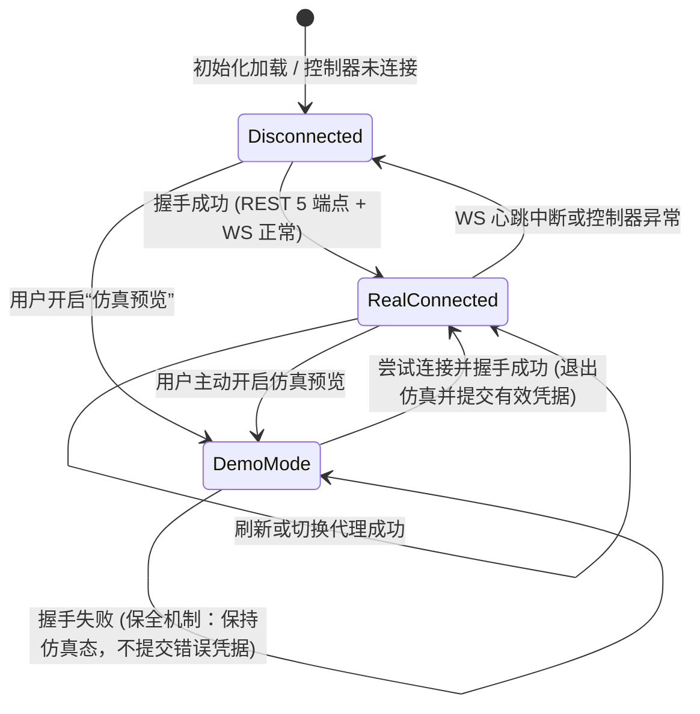

# Mihomo (Clash Meta) 控制台｜视觉与交互规格规范（全新设计稿）

> **设计基准确认**：`demo.jpeg` 是一张宣传海报，其画面中央深色圆角矩形边界内（约 x:55..1020, y:459..1102）所呈现的界面是**完整的 Web 全屏应用工作台页面**，而非嵌入在黑色相框或居中固定卡片中的局部部件。
> 本规范在高度对齐海报截图中“清新版工作台”的视觉韵律、卡片构成、字体排印与高质感细节的前提下，将界面全部内容严格、真实地映射至真实的 Clash Meta / mihomo REST + WebSocket 核心语义，纠正所有虚构或不受支持的伪语义，杜绝一切不可靠推断。

> **📌 当前 Overview 布局覆盖说明（2026-09-26，优先于下文旧版布局）**：现行总览顺序为：状态提示条 →「活动连接与服务」原有四张状态卡 → 全宽「实时速率」→ 全宽「规则链路流向」→「策略组分流」三张并排卡 →「活动连接」三类排行（活跃域名／出站／来源）。实时速率仅绘制已收到的 WS 采样，固定最近 5 分钟，横轴每 45 秒一段，纵轴按速率自动选择 1／10／50／100／500 档上限并分为五段，不补造历史；规则流向从最近 32 条**当前活动连接**中选出现最多的一条真实链路展示，不包含已结束连接的历史。三类排行基于当前活动连接的实际上下行字节量。**双分配条带、连接明细表、META Core Hero 和旧版 42:58 双栏均已移除。**后续旧版章节仅作历史设计背景，不应据此恢复旧结构。

---

## 目录
1. [设计定位与核心原则](#1-设计定位与核心原则)
2. [设计令牌系统 (Design Tokens)](#2-设计令牌系统-design-tokens)
3. [核心业务与数据语义映射 (REST & WS)](#3-核心业务与数据语义映射-rest--ws)
4. [三态运行模型与保全生命周期 (Demo / Real / Disconnected)](#4-三态运行模型与保全生命周期-demo--real--disconnected)
5. [页面布局与 DOM 架构详解](#5-页面布局与-dom-架构详解)
   - 5.1 [顶部紧凑横向导航与工具栏](#51-顶部紧凑横向导航与工具栏)
   - 5.2 [内核大标题与行内元数据横幅](#52-内核大标题与行内元数据横幅)
   - 5.3 [双分段色彩/花纹配比进度条带](#53-双分段色彩花纹配比进度条带)
   - 5.4 [纤细横向分隔线与微排版](#54-纤细横向分隔线与微排版)
   - 5.5 [下层不对称双主栏：左侧 Deal History 风格策略组](#55-下层不对称双主栏左侧-deal-history-风格策略组)
   - 5.6 [下层不对称双主栏：右侧 4 宫格系统状态与连接明细](#56-下层不对称双主栏右侧-4-宫格系统状态与连接明细)
6. [标志性纯白圆形图标按钮系统 (Circular Action Buttons)](#6-标志性纯白圆形图标按钮系统-circular-action-buttons)
7. [子页面承接与全局路由机制](#7-子页面承接与全局路由机制)
8. [视口比例、垂直韵律与响应式断点映射](#8-视口比例垂直韵律与响应式断点映射)
9. [微交互与状态反馈细则](#9-微交互与状态反馈细则)
10. [实施前后对比与验收清单](#10-实施前后对比与验收清单)
11. [向实现 Agent (Antigravity) 的交接指南](#11-向实现-agent-antigravity-的交接指南)

---

## 1. 设计定位与核心原则

### 1.1 纠偏与废除项
1. **废除外层黑色包边画框**：海报外围的黑色圆角框属于样机展示壳，产品界面自身**不带** `#20211F` 外框，直接以全屏画布铺展。
2. **废除固定左侧窄侧边栏**：不再使用 208px 的固定左侧侧栏，导航全面移至顶部横向紧凑栏。
3. **废除通用三卡片与图表网格**：废弃传统的“实时下行 / 实时上行 / 内存”独立三卡片与底部杂乱图表，严格复现截图中上方“双分段配比条带 + 大额数值”及下方“不对称双主栏”结构。
4. **废除一切虚构与不受支持的 API 语义**：
   - **严禁捏造虚假后端端点**：如 `POST /restart` 重启、手动 GC 垃圾回收触发端点。
   - **严禁捏造虚构指标**：如核心内存中的“Goroutine 数量”、策略组与规则的“规则命中次数”、虚构的“DNS 延迟 [+24ms]”与“TUN 虚拟网卡已接管”状态。
   - **严禁主观推断系统元数据**：`GET /version` 并不保证包含 CPU 架构与 Go 编译器版本，严禁在前端推断或伪造 `Linux/amd64 (Go 1.23)`。
   - **严禁在真实模式中硬编码分布比例**：左侧条带（56%/18%/16%/10%）与右侧条带（65%/25%/10%）在真实模式下必须由活跃连接动态统计生成；截图中固定样例值仅用于仿真预览（Demo Mode）且必须显式标注 `【仿真】`。
   - **严禁在空载时显示假等分比例**：当活动连接为 0 时，严禁显示假冒的等分彩色进度条，必须如实显示单段中性中空空载轨条（Neutral Empty Track）。
   - **严禁无响应的“装饰性假按钮”**：页面上所有按钮必须清晰映射到已支持的前后端交互，或明确禁用并提供 Tooltip 原理解释。

### 1.2 核心视觉气质：“清新版工作台 (Fresh Workbench)”
- **画布背景**：宽幅流动的浅薄荷绿（`#F0F6F2`）到淡薰衣草紫（`#F0EEF8`）的平滑低饱和渐变，营造宁静、专业、通透的系统操作氛围。
- **材质分层**：面板采用高透磨砂白（`rgba(255, 255, 255, 0.72)` ~ `0.85`）与 `backdrop-filter: blur(16px)`，边缘配有极其柔和的半透明浅灰白色描边（`rgba(255, 255, 255, 0.85)` / `rgba(0, 0, 0, 0.05)`），阴影极其克制（低扩散、低不透明度）。
- **交互特征**：高频使用**纯白实心微阴影圆形按钮（White Circular Icon Buttons）**作为动作入口（刷新、更多、外链、测速、切换、断开）；胶囊状分段状态条与等宽数字（Tabular Numbers）提供严谨的排障读数。
- **真实严谨语义**：界面文字采用自然亲切的人性化简体中文，所有数字指标严格对应 mihomo REST API 与 WebSocket 实时数据，绝无编造伪数据。

---

## 2. 设计令牌系统 (Design Tokens)

### 2.1 CSS 变量全集
```css
:root {
  /* 1. 画布与背景 (Canvas & Backgrounds) */
  --bg-page-gradient: linear-gradient(135deg, #F0F6F2 0%, #F5F6FA 45%, #F0EEF8 100%);
  --bg-panel-glass: rgba(255, 255, 255, 0.74);
  --bg-panel-solid: #FFFFFF;
  --bg-panel-subtle: rgba(255, 255, 255, 0.55);
  --bg-hover-subtle: rgba(0, 0, 0, 0.035);

  /* 2. 边框与分隔线 (Borders & Dividers) */
  --border-panel: rgba(255, 255, 255, 0.85);
  --border-subtle: rgba(0, 0, 0, 0.06);
  --border-divider: #E4E8E2;
  --border-active: #2E68F8;
  --border-empty-track: rgba(0, 0, 0, 0.08);
  --bg-empty-track: rgba(0, 0, 0, 0.04);

  /* 3. 字体颜色 (Typography Colors) */
  --text-primary: #181A18;       /* 标题与主要数值，极深炭黑 */
  --text-secondary: #565C54;     /* 次级标签与正文 */
  --text-muted: #888E84;         /* 微排版、时间戳、说明注记 */
  --text-link: #2862E8;          /* 交互式超链接专用蓝（对应截图连接行） */
  --text-inverse: #FFFFFF;

  /* 4. 截图特征色盘 (Screenshot Characteristic Palette) */
  --accent-blue-solid: #2E68F8;  /* 截图左侧条带首段、核心高亮蓝 */
  --accent-blue-sky: #6FA2F7;    /* 截图左侧条带第二段 */
  --accent-blue-periwinkle: #A2C2F8; /* 截图左侧条带第三段 */
  --accent-mint-tint: #E0ECE7;   /* 截图左侧条带第四段、浅薄荷透色 */
  --accent-dark-charcoal: #202321; /* 截图右侧条带首段、黑色药丸按钮 */
  --accent-dark-stripe: #88908A; /* 截图右侧斜纹段 */
  --accent-light-texture: #DEE2DC; /* 截图右侧浅质感段 */
  --accent-cream-sand: #F4EDE2;  /* Deal History 浅卡其/奶油色药丸底 */
  --accent-cream-text: #8A5B18;  /* Deal History 奶油色药丸字体色 */

  /* 5. 状态语义色 (Status Colors) */
  --status-green: #24824F;
  --status-green-bg: #EAF5ED;
  --status-amber: #B45309;
  --status-amber-bg: #FEF3C7;
  --status-red: #C53030;
  --status-red-bg: #FEE2E2;

  /* 6. 纯白圆形动作按钮专有令牌 (White Circular Buttons) */
  --btn-circle-bg: #FFFFFF;
  --btn-circle-border: rgba(0, 0, 0, 0.08);
  --btn-circle-shadow: 0 1px 3px rgba(0, 0, 0, 0.04), 0 2px 6px rgba(0, 0, 0, 0.02);
  --btn-circle-hover-bg: #F9FAF8;
  --btn-circle-hover-border: rgba(0, 0, 0, 0.14);
  --btn-circle-hover-shadow: 0 3px 8px rgba(0, 0, 0, 0.07);

  /* 7. 圆角与几何 (Curvature & Geometry) */
  --radius-panel: 20px;          /* 主面板与下层两列主卡大圆角 */
  --radius-card: 14px;           /* 4宫格系统卡片、Deal 列表行圆角 */
  --radius-ribbon: 12px;         /* 分段进度条圆角 */
  --radius-pill: 9999px;         /* 导航活动项、状态标签、延迟药丸 */
  --radius-circle: 50%;          /* 纯白图标按钮、节点国旗头像 */

  /* 8. 阴影系统 (Shadows) */
  --shadow-panel: 0 6px 24px rgba(20, 28, 20, 0.035), 0 1px 3px rgba(0, 0, 0, 0.02);
  --shadow-card: 0 2px 10px rgba(0, 0, 0, 0.03);
  --shadow-dropdown: 0 12px 32px rgba(20, 28, 20, 0.12);

  /* 9. 字体栈 (Typography Stacks) */
  --font-sans: -apple-system, BlinkMacSystemFont, "PingFang SC", "Segoe UI", Roboto, "Helvetica Neue", sans-serif;
  --font-mono: ui-monospace, "SF Mono", Menlo, Consolas, monospace;
}
```

### 2.2 纹理与花纹条带专属样式 (Pattern Styles)
为了在视觉质感上高保真复现截图中右侧进度条的网点与斜纹肌理，定义以下纯 CSS 纹理生成类：
```css
/* 碳黑微圆点纹理 */
.pattern-dots-dark {
  background-color: var(--accent-dark-charcoal);
  background-image: radial-gradient(rgba(255, 255, 255, 0.22) 1px, transparent 1px);
  background-size: 5px 5px;
}

/* 灰调 45度斜向条纹纹理 */
.pattern-stripes-gray {
  background-color: var(--accent-dark-stripe);
  background-image: repeating-linear-gradient(
    45deg,
    rgba(255, 255, 255, 0.18) 0px,
    rgba(255, 255, 255, 0.18) 3px,
    transparent 3px,
    transparent 6px
  );
}

/* 浅色细密网格质感 */
.pattern-hatch-light {
  background-color: var(--accent-light-texture);
  background-image: repeating-linear-gradient(
    -45deg,
    rgba(0, 0, 0, 0.04) 0px,
    rgba(0, 0, 0, 0.04) 2px,
    transparent 2px,
    transparent 4px
  );
}

/* 诚实空载单轨纹理 */
.pattern-empty-track {
  background-color: var(--bg-empty-track);
  border: 1px dashed var(--border-empty-track);
  color: var(--text-muted);
}
```

---

## 3. 核心业务与数据语义映射 (REST & WS)

界面视觉元素严格映射自真实的 mihomo (Clash Meta) 运行时接口，绝无编造伪数据，全面纠正不受支持的危险假设：

| 截图原始视觉位置 | 截图中原始 CRM 元素 | Mihomo Dashboard 真实网络语义映射 | 对应后端 API / WebSocket 数据源与语义约束 |
| :--- | :--- | :--- | :--- |
| **顶部顶栏左** | FISHBOWL 品牌 | **Mihomo / Clash Meta** 控制台图标与标题 | 静态品牌资产 + 运行状态指示 |
| **顶部顶栏中** | Home, Feeds, Leads, Accounts(黑药丸)... | **横向紧凑导航栏**：总览（默认深黑药丸）、代理、连接、规则、日志、配置 | 本地 Hash 路由状态切换 |
| **顶部顶栏右** | 搜索 / 通知 / 同步 / 头像 | **工具组**：运行模式切片、仿真开关、核心状态药丸、刷新按钮、设置按钮、端点头像 | `/configs` (mode), ControllerContext |
| **大标题区** | `BlueRock Pvt Ltd` + 标签 | **内核主控标题**：`Mihomo Core` + 胶囊标签 `{version.version || 'Mihomo'} · {config.mode} 模式` | `GET /version` + `GET /configs` |
| **标题左动作** | 白色圆形回退按钮 `(←)` | **重连核心 / 刷新状态按钮**（重新发起握手与数据同步） | 触发 `connectController()` / `refreshAll()`。**明确修正：Mihomo REST API 原生不支持 `POST /restart`，不捏造假端点** |
| **标题右动作** | 白色圆形 `···` 与 `↗` | **控制中心菜单** 与 **外链跳转**（打开外部文档/导出配置） | 呼出功能菜单 / 新标签页打开官方文档 |
| **行内元数据1** | `Industry: Large Enterprise` | **核心版本 (Core Version)**：直接展示 `version.version`（如 `v1.19.3`） | `GET /version`。**明确修正：该接口仅提供 `{ version, meta?, premium? }`，并不保证返回 CPU 架构或 Go 编译器版本，严禁推断或捏造 Linux/amd64 或 Go 1.23** |
| **行内元数据2** | `Annual Revenue: $700,000,000` | **运行模式**：`规则分流 (Rule)` / `全局代理 (Global)` / `直连 (Direct)` | `GET /configs` (mode，点击可快速切换) |
| **行内元数据3** | `Account Owner: Amelia Brain` | **控制端点**：`127.0.0.1:9090` | 当前控制器主机与端口设置 (`baseUrl`) |
| **行内元数据4** | `Territories: East` | **混合监听端口**：`7890 (Mixed)` | `GET /configs` (mixed-port / port) |
| **行内元数据5** | `Employees: 4,900` | **生效规则总数**：`4,892 条` | `GET /rules` (rules.length) |
| **左进度条分段** | Seed 56% / Expansion 12% / Growth 16%... | **出站链路分流条带 (Outbound Allocation)**：真实模式下按各代理组/直连连接数动态占比计算；空载显示中性单轨；仿真模式显示逼真样例并标明 `【仿真】` | 聚合计算自 `GET /connections` / WS 连接流的 `chains[0]` 分布。**明确修正：绝不硬编码固定比例为真实数据** |
| **左大额数值** | `$ 789,314,350.00` / Available Capital | **实时下行吞吐大字**：`↓ 24.85 MB/s`，说明：`实时下行速率 · 累计会话下载 789.31 GB` | `WS /traffic` (down) + downloadTotal |
| **左日期微排版** | `2023.11.11` | **采样周期与时间微排版**：`2026.09.26 14:00 · 采样 1s` | 真实系统时间与 WS 心跳时间戳 |
| **右进度条分段** | Projects 10% / Investments 8% / Balance 82% | **传输协议配比条带 (Network Protocols)**：真实模式下按实际 `metadata.network`（TCP vs UDP）动态占比计算；空载显示中性单轨 | 聚合计算自 `GET /connections` network 分布。**明确修正：DNS 在连接元数据中并非独立的传输层协议，严禁虚构 DNS 10% 占比** |
| **右大额数值** | `$ 94,350,000.00` / Capital Employed | **核心内存开销大字**：`128.45 MB`，说明：`系统内存占用 · 系统配额 16.00 GB` | `WS /memory` (inuse / oslimit)。**明确修正：接口仅提供 inuse 与 oslimit，绝无 Goroutine 数量指标，严禁捏造“活跃 Goroutine 320”** |
| **右日期微排版** | `2023.07.01` | **内存采样来源微排版**：`2026.09.26 · WS /memory` | 真实系统时间与内核指标 |
| **左主栏 Deal 行** | 金额药丸+描述+联系人头像+动作 | **策略组分流状态行**：延迟/速率药丸胶囊 + 策略组名 + 选中节点信息 + 测速/切换圆形按钮 | `GET /proxies` 数据。**明确修正：去除虚假“规则命中 3,210 次”；国旗为基于名称的前端匹配；协议使用实际 `node.type`，严禁猜测虚假倍率** |
| **右主栏 4 宫格** | Gmail, Outlook, Yahoo, AOL 4个集成卡 | **4 宫格核心系统卡片**：运行模式 / 混合端口 / 规则总数 / 活跃会话 | 严格对齐真实数据：`/configs` (mode, mixed-port), `/rules` (length), `/connections` (length)。**明确修正：全面废除假 DNS 延迟 [+24ms] 与 TUN [已接管] 虚构状态** |
| **右主栏表格** | 邮件往来明细表格（蓝链接、时间、状态） | **实时网络活动连接追踪表**：目标域名（蓝字链接）、关联进程与链路、连接时间、状态与一键断开 `✕` | `WS /connections` 或实时轮询列表，点击 `✕` 触发 `DELETE /connections/:id` |

---

## 4. 三态运行模型与保全生命周期 (Demo / Real / Disconnected)

界面必须清晰、优雅地呈现三种截然不同的运行状态，并具备严格的**状态转换保全语义**：



### 4.1 仿真预览模式 (Demo Mode)
- **视觉特征**：顶部工具栏显示琥珀金高亮药丸 `✨ 仿真预览中`；大标题下方展示浅暖黄通知横幅：
  > `【仿真预览】当前正在使用内置模拟数据展示界面排版与交互体验。所有策略切换、测速探测、连接断开均为仿真动作。`
- **数据行为**：加载 `demoData.ts` 中的仿真内核信息、策略组、4 宫格卡片与活动连接列表。进度条分段按照展示样例（如 56%, 18%, 16%, 10%）呈现，所有展示指标**显式标注 `【仿真】`**。

### 4.2 实时核心连接模式 (Real Connected Mode)
- **视觉特征**：顶部状态药丸显示翠绿小圆点 `● 已连接`，工具栏展示控制器当前地址与延迟。
- **数据行为与严谨规则**：
  - **实时吞吐与内存**：由 `WS /traffic` 和 `WS /memory` 驱动，每 1000ms 刷新一次。内存读数严格呈现 `inuse` 与 `oslimit`，严禁捏造 Goroutine 数量。
  - **分段配比进度条动态计算**：
    - **左条带（出站链路）**：按当前活动连接列表中的 `chains[0]`（或直连 DIRECT）动态聚合计算连接数占比：`占比 = 该链路活跃数 / 总活跃数 * 100%`。
    - **右条带（传输网络）**：按活动连接的 `metadata.network`（通常为 TCP 与 UDP）动态聚合计算占比。明确：DNS 并非独立传输层网络协议，不虚构 DNS 切片。
  - **诚实空载处理 (Honest Empty Track)**：
    当核心已连接但当前活跃连接数为 0（`connections.length === 0`）时，**严禁使用任何假定的等分比例（如 25%/25%/25%/25% 或 50%/50%）**。此时条带呈现统一的中性浅灰空载轨条（`pattern-empty-track`），并居中展示文本：`当前无活动连接 / 空载`，大字速率真实显示 `0 B/s`。
  - **占位状态**：若某些内核可选字段未返回，显示清晰优雅的占位符 `—`，绝不凭空推断。

### 4.3 核心未连接 / 失联模式 (Disconnected Mode)
- **视觉特征**：顶部状态药丸显示警示红点 `● 核心未连接`；核心大标题下方弹出浅红通栏卡片：
  > `⚠️ 无法连接到 Mihomo 核心 (http://127.0.0.1:9090)。请检查控制器是否已启动、端口与密钥设置是否正确。 [前往配置] [重试连接]`
- **数据行为**：大字号数值退化显示为 `— B/s`、`— MB`；活动连接与策略组显示优雅的空态引导；圆形动作按钮处于禁用或弱化态，避免无效请求。

### 4.4 仿真退出的原子保全机制 (Atomic Handshake Guard)
遵循已通过单元测试验证的 `resolveTransitionOutcome` 规范：
- 用户在仿真模式下修改控制器地址或密钥尝试切换到真实核心时，系统在后台发起 5 端点 REST 探测（`/version`, `/configs`, `/proxies`, `/rules`, `/connections`）。
- **若握手失败**：必须**继续保持仿真模式**，不停止仿真定时器，不提交未验证的错误凭据至 LocalStorage/SessionStorage，同时弹出 Toast 警示。**严禁直接降级退至 Disconnected 导致数据闪烁或丢失**。
- **若握手成功**：方可停止仿真定时器，提交新凭据并无缝过渡至 `RealConnected` 模式。

---

## 5. 页面布局与 DOM 架构详解

全页采用单视口自适应流式网格，不包裹任何多余的外层假窗口画框。

```
.mihomo-viewport
│
├── 1. .top-horizontal-bar (顶部紧凑横向导航与工具区，高度 56px)
│    ├── .nav-brand (Logo + "Mihomo" 品牌字)
│    ├── .nav-tab-group (总览[深黑胶囊] / 代理 / 连接 / 规则 / 日志 / 配置)
│    └── .nav-utility-actions (模式切片 / 演示开关 / 状态药丸 / 纯白圆形按钮组 / 端点头像)
│
├── 2. .core-hero-section (内核大标题与行内元数据横幅，高度 ~72px)
│    ├── .hero-title-group (白圆重连按钮 + "Mihomo Core" 28px大字 + 真实版本模式标签)
│    ├── .hero-inline-metadata (5列真实行内元数据：核心版本 / 运行模式 / 控制端点 / 混合端口 / 规则总数)
│    └── .hero-quick-actions (纯白圆形 "···" 菜单 + 纯白圆形 "↗" 外部文档按钮)
│
├── 3. .allocation-ribbons-section (双分段色彩/花纹配比进度条带，高度 ~116px)
│    ├── .ribbon-card (左卡：流量吞吐与出站链路配比，实测动态/空载单轨)
│    │    ├── .ribbon-header-labels (各链路实测百分比，或空载标注)
│    │    ├── .segmented-ribbon-bar (多色分段进度条/空载单轨 + 纯白圆形 "↗" 查看连接按钮)
│    │    └── .ribbon-metric-footer (大字号 "↓ 24.85 MB/s" + 累计说明 + 右侧时间微排版)
│    │
│    └── .ribbon-card (右卡：核心内存与传输协议配比，实测动态/空载单轨)
│         ├── .ribbon-header-labels (TCP / UDP 实测百分比，或空载标注)
│         ├── .segmented-ribbon-bar (网点/斜纹花纹分段进度条/空载单轨 + 纯白圆形 "✕" 一键清空连接按钮)
│         └── .ribbon-metric-footer (大字号 "128.45 MB" + 系统配额说明 + 右侧来源微排版)
│
├── 4. .slim-divider-line (纤细横向分隔线，高度 1px，边缘轻淡出)
│
└── 5. .dashboard-asymmetric-grid (下层不对称双主栏，比例 42% : 58%)
     │
     ├── 5.1 .panel-left-deal-style (左主栏：策略组分流状态，Deal History 风格)
     │    ├── .panel-header ("策略组分流" 17px标题 + 纯白圆按钮 "···", "↗")
     │    └── .deal-rows-container (纵向排列的策略组高密度行)
     │         └── .deal-row-card (左侧大彩色药丸胶囊 + 策略名 + 右侧国旗头像 + 真实协议 + 测速/切换圆按钮)
     │
     └── 5.2 .panel-right-system-style (右主栏：系统卡片与连接明细)
          ├── .panel-header ("活动连接与服务" 17px标题 + 纯白圆按钮 "✕", "···", "↗")
          ├── .service-integration-grid (4 宫格真实系统卡：运行模式 / 监听端口 / 生效规则 / 活跃连接)
          └── .connections-dense-table (高密度实时连接表：目标蓝链接 / 进程链路 / 时间 / 单连接断开 ✕)
```

---

### 5.1 顶部紧凑横向导航与工具栏

#### 视觉细节与测量
- **高度**：`56px`，左右内边距 `28px`，背景为轻微半透明白底（`rgba(255, 255, 255, 0.45)`），毛玻璃虚化 `12px`，底边 `1px solid var(--border-subtle)`。
- **左侧品牌**：Logo（28×28px 几何立方/圆环徽标）+ 标题字 `Mihomo`（15px，`font-weight: 700`，字间距 `-0.01em`）。
- **中间横向导航 (Tabs)**：
  - 排布：`总览`、`代理`、`连接`、`规则`、`日志`、`配置`。
  - 活动项（Active）：**深黑圆角胶囊**（`background: var(--text-primary); color: #FFFFFF; font-weight: 600; padding: 6px 18px; border-radius: 9999px; box-shadow: 0 2px 8px rgba(0,0,0,0.14); font-size: 13px;`）。
  - 未选中项：浅灰无边框文字按钮（`color: var(--text-secondary); padding: 6px 14px; font-size: 13px; font-weight: 500; border-radius: 9999px; transition: all 0.15s;`），悬停背景 `rgba(0, 0, 0, 0.04)`。
- **右侧工具区**：
  - 运行模式切片胶囊（`规则 / 全局 / 直连`，高 28px，底色 `rgba(0,0,0,0.05)`，点击触发 `updateConfigMode`）。
  - 仿真模式开关胶囊（带金色高光 Sparkle 图标，点击触发 `setDemoMode`）。
  - 连接状态徽标（`● 已连接` 绿点胶囊，或未连接红点）。
  - 纯白圆形动作按钮：`🔄 刷新`（32×32px，触发 `refreshAll`）、`⚙️ 设置`（32×32px，唤出设置模态框）。
  - 端点头像（32×32px 圆形单色/渐变头像环，显示当前连接端点字母缩写）。

---

### 5.2 内核大标题与行内元数据横幅

#### 视觉细节与测量
- **外层容器**：`display: flex; align-items: center; justify-content: space-between; padding: 20px 0 16px 0; gap: 24px;`。
- **左侧核心标题组**：
  - 重连圆形按钮：`36×36px` 纯白圆形动作按钮，内置左向/重连箭头图标，点击调用 `connectController()` 执行端点握手重连与数据刷新。明确不捏造 `POST /restart`。
  - 主标题：`Mihomo Core`（字号 `28px`，行高 `1.15`，`font-weight: 700`，颜色 `var(--text-primary)`，字间距 `-0.02em`）。
  - 行内版本胶囊：紧挨主标题右侧，浅灰白背景（`#ECEFEA`），文字如 `v1.19.3 · 规则模式`（字号 `12px`，文字 `var(--text-secondary)`，内边距 `4px 10px`，圆角 `9999px`）。
- **中间行内元数据网格 (Inline Metadata)**：
  - 结构：水平排列的 5 个等距元数据单元格（对齐截图中 5 列元数据形式）。
  - 每个单元格自上而下：
    1. 上层微标题（Label）：`字号: 11px; color: var(--text-muted); font-weight: 500; letter-spacing: 0.02em; text-transform: uppercase; margin-bottom: 2px;`
    2. 下层主数值（Value）：`字号: 14px; color: var(--text-primary); font-weight: 600; font-variant-numeric: tabular-nums;`
  - 5 项真实语义内容：
    1. `核心版本` → 直接呈现 `version.version`（如 `v1.19.3`），不可用时显示 `—`。严禁推断架构或 Go 版本。
    2. `运行模式` → `规则分流 (Rule)` / `全局代理 (Global)` / `直接连接 (Direct)`。
    3. `控制端点` → `127.0.0.1:9090`。
    4. `混合端口` → `7890 (Mixed)`。
    5. `生效规则` → `4,892 条`（取自 `rules.length`）。
- **右侧快捷工具**：
  - 包含两个纯白圆形按钮：`···`（36×36px 快捷操作菜单，提供模式微调与日志管理）和 `↗`（36×36px 新标签页打开官方文档或外部仪表盘）。

---

### 5.3 双分段色彩/花纹配比进度条带

高度复现截图中并排的两个大卡片，采用多段进度条与下方大额排版数值：

```
+---------------------------------------------+---------------------------------------------+
| 【仿真】直连 56%  专线 18%  媒体 16%  其他 10% (↗) | 【仿真】TCP 70%   UDP 30%              (✕) |
| [===蓝===][==天蓝==][==紫蓝==][==浅薄荷==]   | [:::网点:::][///斜纹///]                    |
| (真实模式: 依据活动连接 chains[0] 动态统计占比) | (真实模式: 依据活动连接 network 动态统计占比)  |
|                                             |                                             |
| ↓ 24.85 MB/s                     2026.09.26 | 128.45 MB                        2026.09.26 |
| 实时下行速率 · 累计会话下载 789.31 GB 采样周期 1s | 核心内存占用 · 系统限制 16.00 GB    来源 /memory |
+---------------------------------------------+---------------------------------------------+
```

#### 左卡：流量吞吐与出站分流配比条带
1. **顶部分段说明标签**：
   - **真实模式**：动态计算当前活动连接在各出站链路（`chains[0]`）上的占比，并列出前 3-4 个主要出站标签与百分比。
   - **空载状态**：无活动连接时，标签显示 `无活跃出站连接`。
   - **仿真模式**：显示预设比例标签，并明确加注 `【仿真】`。
2. **多色分段进度条**：
   - 高度：`30px`，圆角：`10px`，容器 `overflow: hidden; display: flex; align-items: stretch; margin: 8px 0 16px 0;`。
   - **真实有连接时**：按实际百分比动态分配各切片宽度，应用色卡 `--accent-blue-solid`, `--accent-blue-sky`, `--accent-blue-periwinkle`, `--accent-mint-tint`。
   - **真实空载时 (0 连接)**：渲染整根单段诚实中性空载轨（`.pattern-empty-track`），严禁使用等分假比例。
   - **条带右侧纯白圆按钮 `(↗)`**：`28×28px` 纯白圆形动作按钮，点击直接路由至完整连接页面（`#connections`）。
3. **主读数与微排版**：
   - 主数值：`font-size: 32px; font-weight: 700; color: var(--text-primary); line-height: 1.1; letter-spacing: -0.02em;`，显示 `↓ 24.85 MB/s`（真实 `WS /traffic` 下行速率换算）。
   - 副说明（左下）：`字号: 12px; color: var(--text-secondary); margin-top: 4px;`，显示 `实时下行速率 · 累计会话下载 789.31 GB`。
   - 日期戳（右下）：`字号: 11px; color: var(--text-muted); font-variant-numeric: tabular-nums; text-align: right;`，精确呈现时间微排版 `2026.09.26 14:00:12`。

#### 右卡：核心内存与传输协议配比条带
1. **顶部分段说明标签**：
   - **真实模式**：根据连接列表的 `metadata.network`（通常为 TCP 与 UDP）动态聚合计算百分比，显示 `TCP 传输` 与 `UDP 传输`。明确修正：DNS 在连接中不是独立的传输层网络协议，严禁捏造 DNS 10% 假标签。
   - **空载状态**：无活动连接时，标签显示 `无活跃传输协议`。
   - **仿真模式**：显示示例比例并加注 `【仿真】`。
2. **花纹分段进度条 (Patterned Ribbon)**：
   - 高度：`30px`，圆角：`10px`，`overflow: hidden; display: flex; margin: 8px 0 16px 0;`。
   - 段 1 (TCP)：按实际 TCP 占比分配宽度，应用 `.pattern-dots-dark` 碳黑微圆点纹理。
   - 段 2 (UDP)：按实际 UDP 占比分配宽度，应用 `.pattern-stripes-gray` 灰调斜纹纹理。
   - **空载时**：应用整根单段中性浅灰空载轨（`.pattern-empty-track`）。
   - **条带右侧纯白圆按钮 `(✕)`**：`28×28px` 纯白圆形动作按钮。
     - **明确修正**：**原稿中的“手动 GC 垃圾回收 (+)”被彻底废除**（Mihomo 由 Go runtime 自动回收垃圾，无手动 GC 接口）。
     - **有效动作映射**：该按钮映射为**一键断开所有活跃连接 (Close All Connections)**，点击弹出二次确认对话框并调用 `DELETE /connections`。若不启用此动作，则予以省略或禁用，悬浮提示“核心自动管理内存”。严禁无响应的假按钮。
3. **主读数与微排版**：
   - 主数值：显示 `128.45 MB`（真实 `WS /memory` inuse 换算），字号 `32px`，加粗。
   - 副说明（左下）：**严禁出现虚构的“活跃 Goroutine 320”**。真实展示系统内存限制：`系统内存占用 · 系统限制 16.00 GB`（来自 `oslimit`，若为 0 或未限制则显示 `系统内存占用`）。
   - 来源戳（右下）：靠右对齐的微排版 `2026.09.26 · WS /memory`。

---

### 5.4 纤细横向分隔线与微排版
- 在双进度条带与下层双主栏之间，设置一条极细且优雅的分隔线条：
  ```css
  .slim-divider-line {
    width: 100%;
    height: 1px;
    background: linear-gradient(90deg, rgba(0,0,0,0.02) 0%, var(--border-divider) 15%, var(--border-divider) 85%, rgba(0,0,0,0.02) 100%);
    margin: 22px 0 24px 0;
  }
  ```

---

### 5.5 下层不对称双主栏：左侧 Deal History 风格策略组

#### 栏目排版规格
- **宽度占比**：约 `42%`（与右栏构成 42%:58% 的不对称主次对比）。
- **面板材质**：`background: var(--bg-panel-glass); backdrop-filter: blur(16px); border: 1px solid var(--border-panel); border-radius: var(--radius-panel); padding: 22px; box-shadow: var(--shadow-panel);`。
- **栏目标题行**：
  - 左侧标题：`策略组分流`（`font-size: 17px; font-weight: 700; color: var(--text-primary);`）。
  - 中间装饰：微妙的灰色三点指示符 `···`。
  - 右侧动作：两个纯白圆形按钮：`···`（筛选策略组视图）和 `↗`（打开完整代理页面 `#proxies`）。

#### 紧凑行结构 (Deal History Row)
严格对齐原截图中左侧大彩色药丸胶囊、下方多级说明、右侧圆形头像及双操作按钮的排布，同时修正底层数据语义：

```
+--------------------------------------------------------------------------------+
|  [ ⚡ 32 ms  (↗) ]          (🇭🇰)  香港 01 [IEPL 专线]               (⚡)    (⇄) |
|  节点选择 (Proxy Group)            Hysteria2                                  |
|  类型: Selector · 包含 10 个节点 · 13:58 测速                                  |
+--------------------------------------------------------------------------------+
```

1. **行容器 (`.deal-row-card`)**：
   - 布局：`display: flex; align-items: center; justify-content: space-between; padding: 14px 16px; margin-bottom: 12px; background: rgba(255, 255, 255, 0.6); border: 1px solid rgba(0, 0, 0, 0.04); border-radius: var(--radius-card); transition: all 0.18s;`。
   - 悬停：`background: rgba(255, 255, 255, 0.95); border-color: rgba(0, 0, 0, 0.08); box-shadow: 0 4px 12px rgba(0,0,0,0.03);`。
2. **左半部分：大彩色胶囊与多级文字**：
   - **大彩色药丸胶囊**：
     - 延迟有效时：奶油浅卡其色（`background: var(--accent-cream-sand); color: var(--accent-cream-text);`），文字 `⚡ 32 ms`（大号等宽粗体）。
     - 延迟高或超时时：深色或浅红底色；未测速时显示 `⚡ — ms`。
     - 胶囊右侧内嵌一个微型纯白圆形外跳图标按钮 `(↗)`，点击可快速查看该组全部子节点。
   - **组名标题**：位于胶囊下方，`font-size: 14px; font-weight: 700; color: var(--text-primary); margin-top: 6px;`，如 `节点选择 (PROXY)`。
   - **微排版元数据**：位于组名下方，`font-size: 11px; color: var(--text-muted); margin-top: 2px;`。
     - **明确修正**：**彻底移除原稿中虚构的“规则命中 3,210 次”**（Mihomo API 不统计规则命中数）。如实展示策略类型、子节点总数与最后测速时间：`类型: Selector · 包含 10 个节点 · 13:58 测速`。
3. **右半部分：当前节点头像与双动作按钮**：
   - **国旗头像徽标**：`36×36px` 纯圆头像。根据当前节点名称（如“香港”、“HK”）启发式匹配地区国旗图标（如 🇭🇰），未匹配时展示通用节点图标。此为纯前端展示增强，非 API 原生属性。
   - **节点名称与真实协议说明**：
     - 节点名称：`font-size: 13px; font-weight: 600; color: var(--text-primary);`，如 `香港 01 [IEPL 专线]`。
     - 协议说明：**明确修正：协议必须取自真实的 `node.type`（如 `Hysteria2`、`Shadowsocks`），严禁猜测“1.0x 倍率”或“稳定”等虚假标签**。
   - **最右侧双操作纯白圆形按钮**：
     - 按钮 1（测速）：`30×30px` 纯白圆按钮，内置 `⚡` 图标，点击调用 `testProxyDelay(nodeName)` 测试该节点延迟。
     - 按钮 2（切换）：`30×30px` 纯白圆按钮，内置 `⇄` 图标，点击唤出该策略组节点选择弹窗，选中后调用 `switchProxy(group, node)`。

---

### 5.6 下层不对称双主栏：右侧 4 宫格系统状态与连接明细

#### 栏目排版规格
- **宽度占比**：约 `58%`。
- **面板材质**：与左栏一致的高通透磨砂白面板。
- **栏目标题行**：
  - 左侧标题：`活动连接与服务`（`font-size: 17px; font-weight: 700;`）。
  - 右侧动作：三个纯白圆形按钮：`✕`（一键断开全部连接，带确认弹窗）、`···`（表格排序与列设置）、`↗`（查看全部连接页 `#connections`）。
  - **明确修正**：原稿中头部 `+`（规则/连接快速调试）被废除，因 API 不存在规则调试端点，映射为一键清空连接 `✕` 或排序。

#### 顶部 4 宫格核心系统卡片 (真实 API 驱动)
彻底废除原设计中所谓“智能 DNS [+24ms]”与“TUN 虚拟网卡 [已接管]”等虚构状态（Mihomo 标准 REST API 无 DNS 延迟测试端点，`GET /configs` 也不保证包含 TUN 接管状态）。全面替换为 100% 真实 API 驱动的核心系统状态卡片：

```
+------------------+------------------+------------------+------------------+
|     [规则分流]    |      [7890]      |      [4,892]     |       [24]       |
|      ( 模式 )    |      ( 端口 )     |      ( 规则 )     |      ( 连接 )     |
|     运行分流模式   |   混合监听端口    |   生效分流规则   |   当前活跃连接   |
|   Rule / Global  | Mixed / HTTP 入站 |   GEOIP / 域名   |  实时 WS 会话数  |
+------------------+------------------+------------------+------------------+
```

1. **栅格布局**：`display: grid; grid-template-columns: repeat(4, 1fr); gap: 12px; margin-bottom: 20px;`。
2. **单卡样式 (`.service-card`)**：
   - 尺寸：高度约 `104px`，`background: rgba(255, 255, 255, 0.82); border: 1px solid rgba(0, 0, 0, 0.05); border-radius: var(--radius-card); padding: 12px 10px; display: flex; flex-direction: column; align-items: center; justify-content: center; position: relative; transition: all 0.18s;`。
   - 悬停：`transform: translateY(-2px); box-shadow: 0 6px 16px rgba(0,0,0,0.05); border-color: rgba(46, 104, 248, 0.3);`。
3. **4 张系统卡片真实语义对应**：
   - **卡片 1：运行分流模式 (Run Mode)**
     - 数据源：`GET /configs` (mode)。
     - 中心图标：路由模式切片图标。
     - 右上角角标胶囊：`规则分流` / `全局` / `直连`。
     - 主文字与副文案：`运行分流模式` / `Rule / Global / Direct`（点击可快速切换）。
   - **卡片 2：混合监听端口 (Listening Port)**
     - 数据源：`GET /configs` (mixed-port / port)。
     - 中心图标：网络入站监听图标。
     - 右上角角标胶囊：端口数字（如 `7890`）。
     - 主文字与副文案：`混合监听端口` / `Socks5 & HTTP 监听`。
   - **卡片 3：生效分流规则 (Active Rules)**
     - 数据源：`GET /rules` (rules.length)。
     - 中心图标：分流规则分支图标。
     - 右上角角标胶囊：规则总数（如 `4,892`）。
     - 主文字与副文案：`生效分流规则` / `GEOIP · 域名匹配`。
   - **卡片 4：当前活跃连接 (Active Connections)**
     - 数据源：`GET /connections` 或 WS 连接流 (connections.length)。
     - 中心图标：活跃网络链路图标。
     - 右上角角标胶囊：实时连接数（如 `24`）。
     - 主文字与副文案：`当前活跃连接` / `实时 WS 会话追踪`。

#### 下部高密度活动连接表格 (Dense Connections Table)
复刻截图中带有蓝色超链接、时间与状态胶囊的高密度明细表格：

1. **表头设计 (`.table-header-row`)**：
   - 字体：`11px`，文字颜色 `var(--text-muted)`，字间距 `0.02em`，底边 `1px solid var(--border-subtle)`，高度 `28px`。
   - 列定义：
     - `指示点`（3% 宽度）：选中或活动状态小蓝点。
     - `目标主机 (Host)`（36% 宽度）：请求目的域名或目标 IP。
     - `关联进程与链路 (Process & Chain)`（32% 宽度）：触发程序名及所经代理组。
     - `建立时间 (Time)`（17% 宽度）：时分秒或会话持续时长。
     - `状态与操作 (Action)`（12% 宽度）：状态药丸与单条关闭按钮。
2. **连接行设计 (`.conn-table-row`)**：
   - 高度：`38px`，单行截断省略，垂直居中对齐，鼠标悬停整行加深（`background: rgba(255, 255, 255, 0.95);`）。
   - **目标主机**：极其醒目的**蓝色链接文字**（`color: var(--text-link); font-weight: 500; font-size: 13px;`），如 `api.github.com`、`googlevideo.com`、`chatgpt.com`，点击可复制或查看详细元数据。
   - **进程与链路**：黑色次级字（`font-size: 12px; color: var(--text-secondary);`），如 `Code · 节点选择 → 香港 01`。
   - **时间微排版**：采用等宽数字（`font-variant-numeric: tabular-nums; font-size: 12px; color: var(--text-muted);`），如 `14:00:28`。
   - **状态与关闭**：
     - 状态药丸：`传输中 (Active)` 展现为浅蓝底蓝字胶囊。
     - 关闭动作：右侧紧随微型灰色叉号 `✕`，点击后立即触发单连接断开（调用 `DELETE /connections/:id`），伴有乐观 UI 快速淡出移除。

---

## 6. 标志性纯白圆形图标按钮系统 (Circular Action Buttons)

截图中全页面贯穿使用了**纯白微投影圆形图标按钮**，此为该视觉风格最具辨识度的交互控件。必须建立统一的封装规范：

```css
.btn-circle-action {
  width: 34px;
  height: 34px;
  min-width: 34px;
  border-radius: var(--radius-circle);
  background: var(--btn-circle-bg);
  border: 1px solid var(--btn-circle-border);
  box-shadow: var(--btn-circle-shadow);
  color: var(--text-primary);
  display: inline-flex;
  align-items: center;
  justify-content: center;
  cursor: pointer;
  padding: 0;
  transition: all 0.16s cubic-bezier(0.16, 1, 0.3, 1);
  user-select: none;
}

.btn-circle-action:hover:not(:disabled) {
  background: var(--btn-circle-hover-bg);
  border-color: var(--btn-circle-hover-border);
  box-shadow: var(--btn-circle-hover-shadow);
  transform: translateY(-1px);
}

.btn-circle-action:active:not(:disabled) {
  transform: scale(0.95);
  box-shadow: 0 1px 2px rgba(0, 0, 0, 0.04);
}

.btn-circle-action:disabled {
  opacity: 0.45;
  cursor: not-allowed;
  transform: none;
}

/* 尺寸变体 */
.btn-circle-action.size-sm {
  width: 28px;
  height: 28px;
  min-width: 28px;
}

.btn-circle-action.size-lg {
  width: 38px;
  height: 38px;
  min-width: 38px;
}
```

### 全局应用清单与有效动作映射
每个按钮必须明确绑定到受支持的操作，绝不做装饰性无响应假按钮：

1. **顶栏工具组**：
   - `🔄 刷新`（32px）：触发 `refreshAll()` 重新拉取代理、规则与连接。
   - `⚙️ 设置`（32px）：呼出 `SettingsModal`，供修改控制器地址与密钥。
2. **内核横幅区**：
   - `(←) 重连`（36px）：触发 `connectController()` 执行端点握手验证与重连。
   - `··· 菜单`（36px）：呼出快捷控制菜单（模式微调、清空日志）。
   - `↗ 外链`（36px）：新标签页打开官方文档或外部仪表盘。
3. **双分段进度条带**：
   - 左条带 `(↗)`（28px）：直接路由至连接页面（`#connections`）。
   - 右条带 `(✕)`（28px）：映射至一键断开全部活动连接（调用 `DELETE /connections`，带二次确认），或禁用并提供 Tooltip 提示“核心自动管理内存，无手动 GC 接口”。
4. **左主栏策略组**：
   - 头部 `···`（32px）：筛选与排序策略组视图。
   - 头部 `↗`（32px）：路由至完整代理页面（`#proxies`）。
   - 各策略行 `⚡`（30px）：为该组/节点探测延迟（调用 `testProxyDelay`）。
   - 各策略行 `⇄`（30px）：呼出节点切换弹窗并切换（调用 `switchProxy`）。
5. **右主栏系统/连接**：
   - 头部 `✕`（32px）：一键断开全部连接（`closeAllConnections`），带确认模态框。
   - 头部 `···`（32px）：连接表格排序与列设置。
   - 头部 `↗`（32px）：路由至完整连接页面（`#connections`）。
   - 连接行 `✕`（微型）：单连接断开（调用 `DELETE /connections/:id`）。

---

## 7. 子页面承接与全局路由机制

用户点击顶部导航栏时，切换视图主体，保持顶部导航与底色氛围一致：

1. **总览页 (Overview)**：展示本规范第 5 节描述的完整核心工作台。
2. **代理页 (Proxies)**：
   - 承接现有的 `ProxiesView.tsx` 完整业务逻辑（策略组展开、节点自测速、延迟排序、模式切换）。
   - 容器外框与卡片全面对齐本规范的磨砂玻璃与纯白圆形按钮规范，彻底去除旧版侧边栏。
3. **连接页 (Connections)**：
   - 承接现有的 `ConnectionsView.tsx`（长连接追踪、过滤、搜索、批量断开二次确认模态框、详情抽屉）。
   - 表格样式全面升级为高密度蓝字链接风格。
4. **规则页 (Rules)**：
   - 承接现有的 `RulesView.tsx`（规则载荷、类型筛选、规则数统计）。
5. **日志页 (Logs)**：
   - 承接现有的 `LogsView.tsx`（实时 WebSocket 日志流、自动滚动跟随、关键字搜索）。
6. **配置入口 (Config)**：
   - 由 `SettingsModal.tsx` 设置弹窗承接（外部控制器地址与密钥、运行参数、缓存清理），顶栏与底部导航直接打开弹窗，不再使用独立配置页。

---

## 8. 视口比例、垂直韵律与响应式断点映射

### 8.1 垂直韵律与间距基准
- 全局基准间距：`4px` 的倍数（`8px`, `12px`, `16px`, `20px`, `24px`, `32px`）。
- 页面最大承载宽度：`1560px` 居中（两侧留有至少 `24px` 的呼吸感边距）。
- 视口总览首屏高度规划：在标准 1080p 屏幕（1920×1080）及常见 1440×900 笔记本屏幕上，总览全貌基本可实现一屏完整阅览或仅需极微量滚动。

### 8.2 断点自适应规则
| 断点区间 | 视口宽度 | 顶部导航栏表现 | 内核横幅与元数据 | 双分段进度条带 | 下层双主栏排布 | 4 宫格卡片表现 |
| :--- | :--- | :--- | :--- | :--- | :--- | :--- |
| **桌面宽屏 (Desktop XL)** | ≥ 1280px | 完整横向文本胶囊与全部工具 | 5 列单行横向齐整排开 | 2 列并排（1:1 等宽） | 42% : 58% 不对称并排 | 4 列横向排列 |
| **紧凑桌面 (Desktop SM)** | 1024px – 1279px | 导航文字紧凑排布 | 元数据转为 3+2 两行排列 | 2 列并排，数值字号微调至 28px | 45% : 55% 并排 | 4 列横向排列 |
| **平板设备 (Tablet)** | 768px – 1023px | 导航溢出支持横向平滑滚动 | 元数据转为 2×2 网格卡 | 垂直堆叠为上下两张条带卡 | **改为上下纵向堆叠**：左策略组在上，右连接表在下 | 2×2 网格排列 |
| **移动端 (Mobile)** | < 768px | 转为顶部极简 Bar + 底部药丸导航栏 | 仅保留模式与状态，其余折叠 | 上下堆叠，条带文字精简 | 纵向全宽单列排列 | 左右滑动滚动卡片轨道 |

---

## 9. 微交互与状态反馈细则

1. **节点测速动画**：点击单节点或策略行的 `⚡` 圆形按钮时，按钮内图标呈现平滑的 360° 旋转（`spin-animation`），按钮背景呈现呼吸微光，测速成功后弹出毫秒数 Toast，药丸背景瞬时闪烁浅绿反馈。
2. **乐观断开连接 (Optimistic Connection Closing)**：用户点击连接行右侧 `✕` 时，当前连接行立即应用 `opacity: 0; transform: translateX(12px); transition: all 0.2s;` 瞬间折叠消失，随后向后端发起 `DELETE /connections/:id`。若后端返回错误，则弹出 Toast 提示并恢复该行。
3. **条带分段 Tooltip**：鼠标悬停在分段进度条的任一切片时，向上浮现微型 Tooltip：
   - 如悬停在出站切片时，提示实测连接数：`出站链路 [国外媒体]: 8 条连接 (占比 33.3%)`。
   - 如悬停在协议切片时，提示实测协议数：`活跃 TCP 传输: 20 条连接 (占比 83.3%)`。
   - 空载状态下悬停提示：`当前核心无活动连接`。
4. **键盘可访问性 (a11y)**：所有纯白圆形按钮和胶囊项均具备可见的 `focus-visible` 焦点环（`outline: 2px solid var(--border-active); outline-offset: 2px;`），支持 `Enter` / `Space` 触发，完全无障碍可用。

---

## 10. 实施前后对比与验收清单

| 视觉与交互模块 | 旧版实现现状（待废除/重构） | 新版规范要求（目标验收基准） | 验收状态 |
| :--- | :--- | :--- | :--- |
| **外部视口画框** | 带有 `#20211F` 细黑外框及 `app-container` 假画框 | **彻底移除外框**，由全屏流动的浅薄荷至薰衣草渐变底色通铺 | [ ] 待实现 |
| **导航架构** | 208px 固定左侧侧边栏 | **顶部横向紧凑导航**，活动项为深黑胶囊 `#181A18` | [ ] 待实现 |
| **核心标题区** | 页面仅有普通左侧小标题，无行内元数据 | **28px 大标题 `Mihomo Core` + 5 列真实元数据**（版本/模式/端点/端口/规则，无虚构架构） | [ ] 待实现 |
| **上部概况数据** | 通用三张小卡片（下行、上行、内存） | **双分段配比条带**（左动态出站条带 + 右动态协议条带，实测计算，空载诚实单轨）+ 32px 大字数值 | [ ] 待实现 |
| **条带花纹与排版** | 普通纯色卡片与平铺折线图 | 纯 CSS 实现碳黑网点、灰斜纹与浅质感花纹，右下角配严格时间微排版 | [ ] 待实现 |
| **下层栅格比例** | 58% 代理组 : 42% 连接的传统卡片 | **42% : 58% 不对称双主栏**，高度复现截图整体骨架 | [ ] 待实现 |
| **左栏行排版** | 普通代理组列表与子节点折叠标签 | **Deal History 风格紧凑行**：大彩色药丸胶囊 + 国旗头像 + 真实协议 + 双白圆按钮，无假命中数 | [ ] 待实现 |
| **右栏系统卡片** | 无系统卡片，直接罗列连接 | **4 宫格真实系统卡**（运行模式、监听端口、规则总数、活跃连接，绝无假 DNS/TUN 状态） | [ ] 待实现 |
| **右栏表格排版** | 传统连接卡片 | **高密度明细表**：亮蓝主机超链接、进程链路、等宽时间、单行关闭 | [ ] 待实现 |
| **按钮系统** | 普通胶囊按钮与方角按钮 | **全局统一纯白实心微投影圆形按钮 (White Circular Icon Buttons)**，动作映射真实受支持 | [ ] 待实现 |
| **子页面承载** | 仅侧栏能切换页面 | 顶部横向导航丝滑切换 6 大功能视图，保持底层功能完全正常 | [ ] 待实现 |
| **三态与保全** | 仅有简单横幅提示 | 清晰区分 **仿真预览 (Demo)**、**实时在线 (Real)** 与 **未连接 (Disconnected)**，握手失败保全仿真态 | [ ] 待实现 |

---

## 11. 向实现 Agent (Antigravity) 的交接指南

后续接手的 Antigravity 编码实现 Agent，应按以下步骤推进代码重构：

1. **第一步：重构样式令牌与全局骨架**
   - 修改 `src/styles/variables.css`，填入本规范第 2 节的完整 CSS Tokens（含 `.pattern-empty-track`）。
   - 重构 `src/styles/global.css`，移除 `.app-frame` 和 `.app-container` 的黑框约束与侧栏定位，构建全屏通铺渐变视口 `.mihomo-viewport`。
2. **第二步：重组顶层导航与容器组件**
   - 移除 `Sidebar.tsx` 对桌面布局的强制占用，在 `Navbar.tsx` 中实现顶部横向导航与深黑活动胶囊。
   - 在 `App.tsx` 中调整视图承接层，使 `OverviewView.tsx` 与各子页面无缝由顶部横向导航驱动。
3. **第三步：全新实现总览页四大核心板块**
   - 板块 1：`<CoreHeaderBanner />`（重连圆按钮 + 28px 核心标题 + 5 列真实元数据 + 右侧圆按钮）。
   - 板块 2：`<AllocationRibbonsBand />`（左出站链路条带 + 右传输网络协议条带 + 大字号数值与微排版；有连接时动态统计，无连接时渲染诚实空载单轨；绝不显示虚构 DNS 协议或 Goroutine 计数）。
   - 板块 3：`<ProxyGroupsDealPanel />`（Deal History 风格大药丸行、国旗头像与测速/切换圆按钮；去除虚构规则命中数，协议使用真实 `node.type`）。
   - 板块 4：`<ServicesAndConnectionsPanel />`（4 宫格真实系统卡片：运行模式/端口/规则数/活跃连接数 + 蓝字链接高密度连接表）。
4. **第四步：全面集成纯白圆形按钮控件**
   - 统一定义 `.btn-circle-action` 类，将刷新、设置、外链、测速、切换、一键断开全面替换为纯白圆形按钮。
   - 确保每个按钮均有明确且支持的动作（无 no-op 假按钮）。
5. **第五步：验证与回归测试**
   - 确保原有 API 封装、URL 拼接与数据格式化测试全部通过。
   - 验证仿真模式与真实连接模式的切换，确保在握手失败时严格保全仿真态，所有数据指标诚实无捏造。
